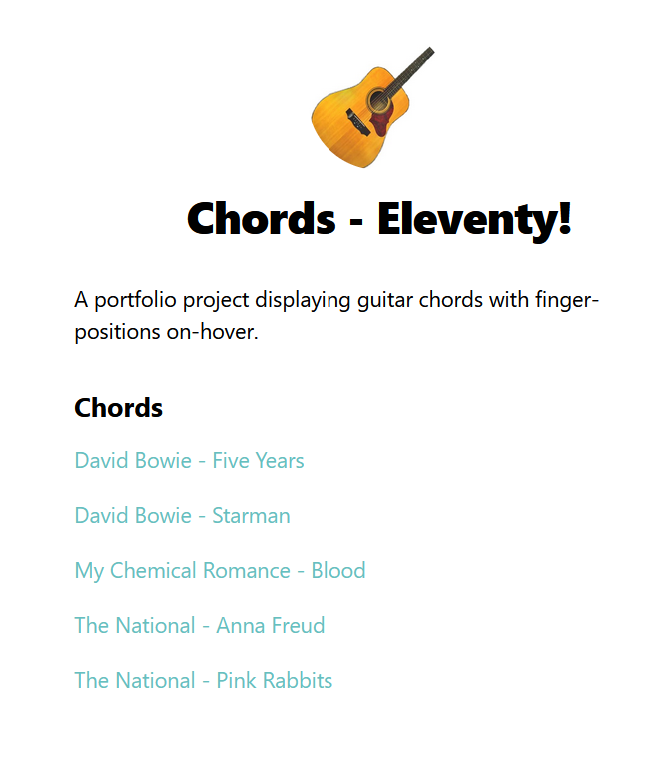

# Chords - Eleventy
A portfolio project displaying guitar chords with finger-positions on-hover. Part of my Chords project - building the same site in different frameworks/with different tools.

This edition is built using [Eleventy](https://www.11ty.dev/), a javascript static-site generator.

Making use of:
- Markdown templates
- Nunjucks layouts
- A custom eleventy plugin to apply styles to chords e.g "Amaj7" and block titles e.g. "\[Verse\]"
- GitHub Actions and GitHub Pages

## See it in action
Visit [Chords - Eleventy](https://emilkloeden.github.io/chords-eleventy/) on GitHub Pages.
